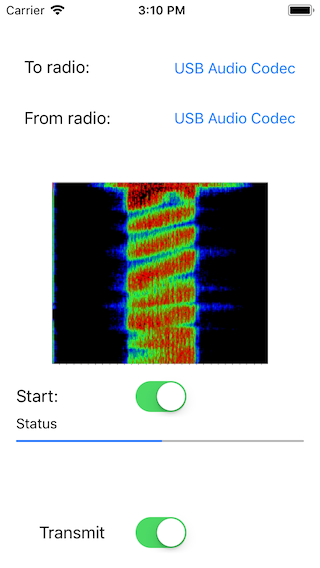
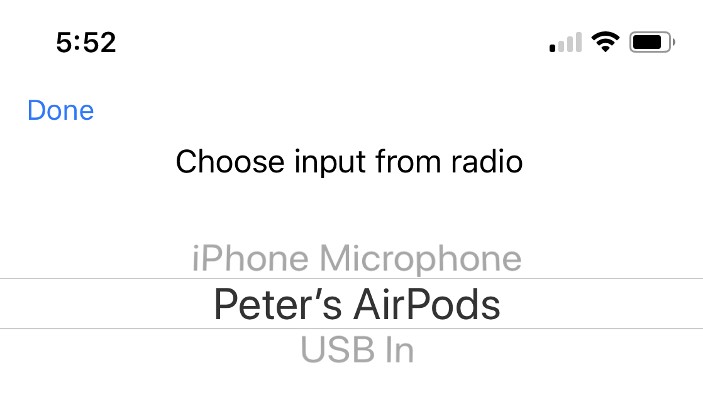

# iOS-FreeDV
This project aims to provide a FreeDV client for iOS.
The objective is to allow you to use an iPhone, iPod touch or iPad to encode and decode off air
using an external USB audio device to interface to the radio and the built-in
speaker and microphone for operator audio.

## Status
This is no where near working yet.

Rough UI:

Here's how we choose an audio input:

## Build on macOS

brew install speex speexdsp 
cd codec2-dev
mkdir build
cd build
cmake ../

